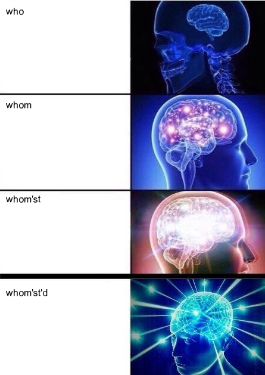

# Expanding Brain (As A Service)

Time to get woke.

Introducing Expanding Brain (As A Service).

With this simple tool, now YOU can be one of millions proving that they exist on a higher plane of consciousness.

# [Demo](http://salockhart.github.io/expanding-brain-as-a-service/)

Add a couple of sentences, and you're good to go

# API

## `GET /brain`

### Description
Takes in a set of four phrases, for each of the four stages of brain activity.

### Parameters
* first

Brain #1 sentence

* second

Brain #2 sentence

* third

Brain #3 sentence

* fourth

Brain #4 sentence

### Return Format
An image

### Example
**Request**
    
    https://expanding-brain-as-a-service.herokuapp.com/brain?first=who&second=whom&third=whom%27st&fourth=whom%27st%27d

**Response**

# Slack

Add Expanding Brain (As A Service) to Slack to add a single command that will immediately bring you to a new level of being.

<!--[See it in the App Directory](https://slack.com/apps/A4VJNNV3P-clap-as-a-service)-->

## Examples

**Command**

    /brain "who" "whom" "whom’st" "whom’st’d"

**Response**

